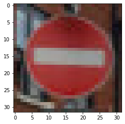

# Project: Build a Traffic Sign Recognition Program
[](http://www.udacity.com/drive)

Overview of udacity
---
In this project, you will use what you've learned about deep neural networks and convolutional neural networks to classify traffic signs. You will train and validate a model so it can classify traffic sign images using the German Traffic Sign Dataset [dowload](https://s3-us-west-1.amazonaws.com/udacity-selfdrivingcar/traffic-signs-data.zip). After the model is trained, you will then try out your model on images of German traffic signs that you find on the web.

[Ipython notebook of udacity](https://github.com/udacity/CarND-Traffic-Sign-Classifier-Project/blob/master/Traffic_Sign_Classifier.ipynb). 


The Project
---
The goals / steps of this project are the following:
* Load the data set
* Explore, summarize and visualize the data set
* Design, train and test a model architecture
* Use the model to make predictions on new images
* Analyze the softmax probabilities of the new images


### Dataset and Repository

1. [Dowload](https://s3-us-west-1.amazonaws.com/udacity-selfdrivingcar/traffic-signs-data.zip) the data set. The classroom has a link to the data set in the "Project Instructions" content. This is a pickled dataset in which we've already resized the images to 32x32. It contains a training, validation and test set.
2. Clone the project, which contains the Ipython notebook and the writeup template.
```sh
git clone https://github.com/DavidSilveraGabriel/Self_driving_car_UdacityND/tree/master/P3-master/
cd CarND-Traffic-Sign-Classifier-Project
jupyter notebook Traffic_Sign_Classifier.ipynb
```

# 0. Load the data and import the libraries  

here import all the libraries that I thought necessary, load the data for training test and validation

# 1. Explore, summarize and visualize the data set
exploring a little we can find the following data: 

- Number of training examples = 34799
- Number of testing examples = 12630
- Number of validation examples = 4410
- Image data shape = (32, 32, 3)
- Number of classes = 43

### We can also see some random images to get an idea of how are the images with which we will work


### And also visualize the distribution of the labels in the training data sets test and validation


# 2. Design train and Test a Model Architecture

the next thing to do is to design and test a model architecture, for this I used the keras library
Keras is an Open Source Neural Network library written in Python. Able to run on TensorFlow

### Pre-process the Data Set
before starting to design and build our model we have to start with the pre-processing of data, for this i use a simple function that normalizes the data between 0 and 1, why, it is simply because I used other preprocessings but they gave me errors when feeding the model and when I only use this it worked perfectly and without overfiting
```python
  def norm(x):
    return x/255
```
then convert class vectors to binary class matrices using ``` keras.utils.to_categorical ``` since is required by keras

## The model arquitecture : 

The model architecture is as follows:
  
  - I add the first layer of the model with kernel size = (3,3), activation relu and a filter of 32
  - The second layer have a filter of 64, the same activation and kernel size than the previous layer
  - Next I add a max pooling for take regions of the image with the size 2x2
  - Now a Dropout of 0.25
  - Then I use flatten to flatten the tensors
  - And I add a deeply connected neural network layer with a imput of 128 and the relu activation
  - Now a Dropout but more higher (0.5)
  - I add the last layer (dense or full connected) with input of number of classes(43) and activation softmax
  - Finally compile using categorical_crossentropy as a loss function, as optimizer to adadelta since it is a more robust      Adagrad extension and it has given me good results,

 


## Train, test and validate the model
for the train we use the fit() from keras 
```python
      model.fit(X_train, y_train,
                batch_size=50,
                epochs=10,
                verbose=1,
                validation_data=(X_valid, y_valid))
```

 

### Validate the model
to validate the model is as easy as using evaluate () and passing the necessary parameters
The result : 
```
    4410/4410 [==============================] - 5s 1ms/sample - loss: 0.1302 - accuracy: 0.9689

    Test accuracy: 0.96893424
```

as the result is satisfactory we will save the model using 

```python 
    model.save('cp_NW.h5')
```

# 3. Use the model to make predictions on new images

### To be sure that the model works in other images than those provided to train, test and validate,
### we will use images taken from the web

the first prediction it will be one where the traffic poster does not occupy the entire image to see if it predicts correctly since the model was trained with images where the traffic signs do occupy all or most of the image


preprocess : applying the same thing that applies to the images of training, test and validation

```python

    img = mpimg.imread('./img/bigstop.jpg')
    img = np.array(img)
    img = cv2.resize(img,(32,32))
    img = norm(img)
    plt.imshow(img)
    img = img.reshape(1, 32, 32, 3)
    # make the predict 
    print("predict : " + str(new_model.predict_classes(img)))
    
>>> predict : [37]
```


now we will see if it worked :D 
here the class id with his respective SignName 
```
	0	Speed limit (20km/h)        // 10    No passing for vehicles over 3.5 metric tons
	1	Speed limit (30km/h)        // 11    Right-of-way at the next intersection
	2	Speed limit (50km/h)        // 12    Priority road
	3	Speed limit (60km/h)        // 13    Yield
	4	Speed limit (70km/h)        // 14    Stop
	5	Speed limit (80km/h)        // 15    No vehicles
	6	End of speed limit (80km/h) // 16    Vehicles over 3.5 metric tons prohibited
	7	Speed limit (100km/h)       // 17    No entry
 	8	Speed limit (120km/h)       // 18    General caution
	9	No passing                  // 19    Dangerous curve to the left
                                            // 20    Dangerous curve to the right

	21	Double curve              // 31 Wild animals crossing
	22	Bumpy road                // 32	End of all speed and passing limits
	23	Slippery road             // 33	Turn right ahead
	24	Road narrows on the right // 34	Turn left ahead
	25	Road work                 // 35	Ahead only
	26	Traffic signals           // 36	Go straight or right
	27	Pedestrians               // 37	Go straight or left
	28	Children crossing         // 38	Keep right
        29	Bicycles crossing         // 39	Keep left
	30	Beware of ice/snow        // 40	Roundabout mandatory
                                          // 41	End of no passing
                                          // 42	End of no passing by vehicles over 3.5 metric
                                
```
The correct is 14 ---> Stop but
unfortunately and predictably the model could not correctly predict the traffic sign (37) ---> Go straight or left
I suppose this is due to the fact that the training was carried out with images where what you want to predict occupies the entire image, and when we pass a new image that does not meet that requirement, the model will end up predicting poorly.

 ## Now the moment of truth, model predictions


We could say that the precision is 87.5% in the test images from the web very good :D 
from eight images only one It was poorly predicted, now we are going to evaluate the model with code

```python
    loss, acc = new_model.evaluate(X_predict_pre, lab)
    print('\nTest accuracy:', acc)
    
>>> 8/8 [==============================] - 0s 2ms/sample - loss: 5.2750 - accuracy: 0.8750

    Test accuracy: 0.875
```

effectively gives us 87.5%


# 4. Analyze the softmax probabilities of the new images

In this part we need analyze the softmax probabilities of the images, specifically we have to get the highest 5 probabilities
and the highest probability of 5 will be the prediction of our model, now we will see only 3 but you can see the others in the notebook
```python
#define the top k function to preprocess, print the image and calculate the highest k probabilities
def top_k(img,k): 
    img = np.array(img)# convert the images to array 
    img = cv2.resize(img,(32,32)) # use the array for resize the new images
    img = norm(img) # normalize the images using the function norm 
    plt.imshow(img) # plot the image 
    img = img.reshape(1, 32, 32, 3) # reshape to put it in the model
    prob = new_model.predict_proba(img) # predict the probabilities 
    return (tf.math.top_k(prob,k)) # return the top 5 probabilities along with his labels
```


### The first image 
The first image is ``` Right-of-way at the next intersection sign ``` 


And the ouput is :
```
    TopKV2(values=<tf.Tensor: shape=(1, 5), dtype=float32, numpy=
    array([[1.0000000e+00, 2.6340477e-10, 2.2860222e-14, 1.2322559e-16,
            4.5063192e-17]], dtype=float32)>,
            indices=<tf.Tensor: shape=(1, 5), dtype=int32, numpy=array([[11, 30, 27, 28, 24]])>)
```
The first number in the array represents the highest probability (1.0000000e+00) equivalent to saying 100%
and what means this array([[11, 30, 27, 28, 24]]) ? --> this is the array of labels corresponding to their probabilities from the previous array, which means that the first element of this array corresponds to the first element of the previous array,
so the label is [11] if we look in the table we can see that id (11) corresponds to ``` Right-of-way at the next intersection ``` 

### The second image 
The second image to analize is  ``` No entry ```



And the ouput is :

```
    TopKV2(values=<tf.Tensor: shape=(1, 5), dtype=float32, numpy=
    array([[9.9995506e-01, 4.4993125e-05, 5.2085892e-12, 6.7491050e-14,
            3.4231776e-14]], dtype=float32)>,
            indices=<tf.Tensor: shape=(1, 5), dtype=int32, numpy=array([[17, 14, 13, 29,  5]])>)
```
As we can see the highest probability is given in [17], so if we search the table effectively, id (17) corresponds to no entry

### The third image
The third image that we will analize is ``` Double curve ```

 

And the ouput is : 

```
    TopKV2(values=<tf.Tensor: shape=(1, 5), dtype=float32, numpy=
    array([[8.2213908e-01, 1.7689212e-01, 9.5721195e-04, 6.2347403e-06,
            5.1042634e-06]], dtype=float32)>,
            indices=<tf.Tensor: shape=(1, 5), dtype=int32, numpy=array([[28, 20, 23, 29,  3]])>)
```
As we can see unfortunately in this image the model fails :( 

# Final considerations
Finishing this writeup I can say that it was a good project that I quite liked to do, the precision was quite high in training: 0.9885 = 98.85% and the validation with the image tests 0.9618 = 96.18% also the validation with the valid images was a little higher 0.9689 = 96.89% so I'm pretty satisfied
Regarding the failure in the image ``` Double curve ```  I imagine that it is because it is very similar to the image that the model predicted, which is that of id = 28 that corresponds to ``` Children crossing ``` both very similar
To improve it, I think that I would have to retrain the model in a new data set, increasing the number of images that are scarce in the 3 datasets, since if they are set to ``` visualize the distribution of classes in the training, validation and test set ``` you can see a clear difference in the number of images per label
giving some labels more than 1000 images and others with less than 500 images

